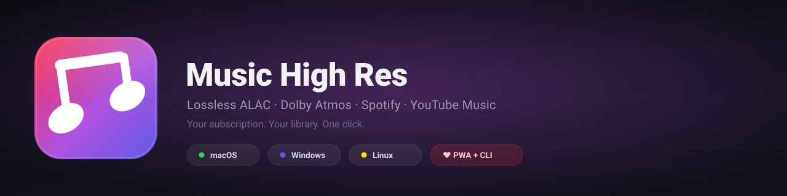
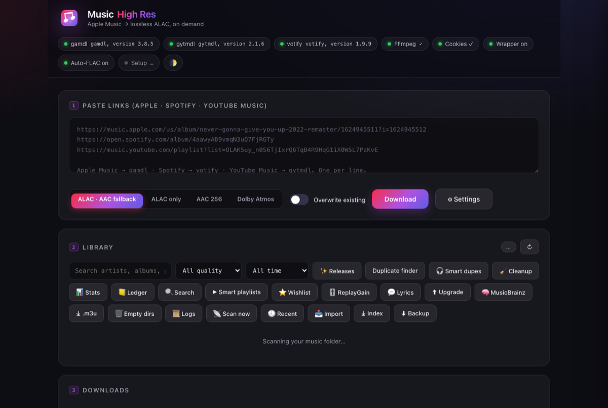

<p align="center">
  
</p>

<p align="center">
  <b>Download lossless ALAC (up to 24-bit/192 kHz), AAC 256 kbps and Dolby Atmos from your Apple Music subscription</b><br>
  — plus <b>Spotify</b> and <b>YouTube Music</b> — into an organized local library you own.<br>
  Ready for Plex, Jellyfin, Navidrome, or any home music server.
</p>

<p align="center">
  <a href="#quick-start"></a>
  <a href="#quick-start"></a>
  <a href="#quick-start"></a>
  
  
  
  
</p>

<p align="center">
  <a href="#quick-start"></a>
</p>

---

## ✨ Highlights

| | | |
|---|---|---|
| 🌐 **Local web app + PWA** | paste Apple Music / Spotify / YouTube links, pick quality, watch downloads live. Installable & works from your phone | 
| ⌨️ **CLI** | the same engine from the Terminal — `cli.py --check`, `--to-flac`, `--ledger` |
| 🔁 **Automatic ALAC → FLAC** | lossless-to-lossless conversion for servers that prefer FLAC |
| 🚀 **One-click boot** | `./start.sh` (macOS + Linux), `Start Music High Res.bat` (Windows), or `Music High Res.app` (macOS) — Docker + wrapper + app all start from one action |
| 🎧 **Three engines** | **gamdl** (Apple Music, default) · **amdl** (Apple, opt-in) · **votify** (Spotify) · **gytmdl** (YouTube Music) |
| 📚 **In-app Library** | artists → albums → tracks, quality badges, search, in-browser player, tag editor |
| 🧠 **Smart tools** | MusicBrainz auto-tagging · smart duplicate finder · FLAC/ALAC cleanup · ledger · wishlist · 30s previews |
| 🛰️ **Media-server ready** | Navidrome / Plex / Jellyfin scan presets · .m3u + CUE export · watch folder |
| 🔄 **Format conversion** | any album → FLAC / MP3 320k / Opus / AAC / OGG (originals kept) |
| 💬 **Lyrics + play tracking** | synced `.lrc` viewer in the player · play counts + last-played in the ledger |
| 🎨 **Make it yours** | light/dark theme · cover viewer & replace · track-level search · library index export |

> 📖 **Everything it can do** — every codec (ALAC / AAC / Atmos / FLAC / Opus / OGG Vorbis), every setting, every CLI flag, every API endpoint — lives in **[FEATURES.md](FEATURES.md)**. Internals: [docs/DOCUMENTATION.md](docs/DOCUMENTATION.md). Release history: **[CHANGELOG.md](CHANGELOG.md)**.

> **Core engines:** Apple Music downloads wrap **[gamdl](https://github.com/glomatico/gamdl)**, with **[amdl](https://github.com/zhaarey/apple-music-downloader)** as a second Apple engine (Settings → Apple engine); Spotify downloads wrap **[votify](https://github.com/glomatico/votify)**; YouTube Music downloads wrap **[gytmdl](https://github.com/glomatico/gytmdl)** — credit for the actual download/decode machinery goes to those projects. This repo adds the friendly UI, CLI, FLAC conversion, wrapper automation, and setup tooling on top. See **Credits**.

---

## 🚀 Quick start

### macOS — one command
Installs Homebrew + gamdl + ffmpeg, downloads the repo, sets up the app:

```bash
curl -fsSL https://raw.githubusercontent.com/ZeroIndents/AppleMusic-Song-Downloader/main/install.sh | bash
```

### Windows — one command
Installs Python + ffmpeg via winget, gamdl via pip, downloads the repo, sets up the app:

```powershell
irm https://raw.githubusercontent.com/ZeroIndents/AppleMusic-Song-Downloader/main/install.ps1 | iex
```

### Linux
```bash
git clone https://github.com/ZeroIndents/AppleMusic-Song-Downloader.git
cd AppleMusic-Song-Downloader
./setup.sh && ./start.sh
```

### Already have the folder?
```bash
# 1. Install prerequisites (macOS)
brew install gamdl ffmpeg

# 2. Set up the app (creates .venv + installs dependencies)
./setup.sh

# 3. Export cookies from a browser signed into music.apple.com → save as cookies.txt
#    (browser extension: "Get cookies.txt LOCALLY")

# 4. Start the app — one click
./start.sh
#    …or double-click Start Music High Res.command (macOS)
#    …or run: ./make_app.sh && open "Music High Res.app" (Dock icon, macOS)

# 5. (Optional, for lossless ALAC) Docker + wrapper — see Step 3
./setup_wrapper.sh ~/Downloads/apple-music.apk
```

**Windows, already have the folder?**
```powershell
# 1. Install prerequisites (one-time)
winget install Python.Python.3.12 Gyan.FFmpeg
pip install gamdl

# 2. Set up the app
.\setup.bat          # or: powershell -NoProfile -ExecutionPolicy Bypass -File setup.ps1

# 3. Export cookies from a browser signed into music.apple.com → save as cookies.txt

# 4. Start the app — one click
.\"Start Music High Res.bat"
#    …or: powershell -NoProfile -ExecutionPolicy Bypass -File start.ps1
#    …or run: .venv\Scripts\python.exe app.py

# 5. (Optional, for lossless ALAC) Docker Desktop + wrapper — see Step 3
#    (the wrapper setup script is bash; on Windows install Git for Windows / Git Bash first)
```

`start.sh` (macOS/Linux) and `start.ps1` (Windows) handle everything: first-run setup, a prerequisite checklist, Docker startup, the ALAC wrapper, the app server, and opening your browser.

> **Requirements:** Python 3.10+ · gamdl (`brew install gamdl` on macOS, `pip install gamdl` elsewhere) · ffmpeg (FLAC + in-app player) · an **active Apple Music subscription** for Apple downloads · Docker Desktop + wrapper for **ALAC / Atmos**.

---

## 🧰 Step 1 — Export your Apple Music cookies (5 minutes)

gamdl logs in as *you* using your browser's Apple Music session cookies.

1. Sign in at **https://music.apple.com** and confirm your subscription is active (play any song).
2. Install a cookie exporter (Netscape format):
   - **Chrome / Edge / Brave**: [Get cookies.txt LOCALLY](https://chromewebstore.google.com/detail/get-cookiestxt-locally/cclelndahbckbenkjhflpdbgdldlbecc)
   - **Firefox**: [Export Cookies](https://addons.mozilla.org/addon/export-cookies-txt)
3. Export **only for `music.apple.com`** and save as **`cookies.txt`** in this folder.
   - Cookies expire — if a download stops with a 401, re-export.
4. The app's header pill should turn green (**Cookies ✓**).

> **Skip this if you use the wrapper (Step 3)** — wrapper mode logs in with your Apple ID directly and doesn't need cookies.

---

## ▶️ Step 2 — Start the app

Four ways to launch — pick your favourite:

- **Universal (macOS + Linux)**: `./start.sh` — the one-click launcher. It runs setup on first launch (even re-runs setup if it detects a half-created `.venv`), prints a friendly checklist (gamdl, ffmpeg, cookies, Docker, wrapper), boots Docker + the ALAC wrapper when present, starts the app, and opens the browser. The ALAC wrapper starts with the app and stops again when you close it — **Docker Desktop itself stays running**. On macOS the first launch also builds `Music High Res.app` and puts a **Desktop shortcut** to it. Flags: `--min` (AAC only, skip Docker/wrapper), `--no-browser`, `--no-docker`.
- **Windows**: double-click **`Start Music High Res.bat`** (or run `start.ps1` — the Windows twin of `start.sh`, same flags: `-Min`, `-NoBrowser`, `-NoDocker`). First launch runs `setup.bat` automatically, and Docker Desktop is launched when installed.
- **Like a normal Mac app**: run `./make_app.sh` once, then double-click **`Music High Res.app`** in Finder. Dock icon + standalone window. *(Stays in the Dock while it runs; right-click → Quit to stop it.)*
- **Classic**: double-click `Start Music High Res.command`, or run `./setup.sh` then `.venv/bin/python app.py` in a Terminal.

All launchers boot Docker + the ALAC wrapper automatically when needed, and reuse an already-running server instead of failing with "Address already in use". The app's header shows a **"0 · Getting started"** checklist so you always know what's left to set up.

→ UI: **http://127.0.0.1:8741**

### Using the web app
1. Paste links — Apple Music, **Spotify**, or **YouTube Music** — one per line. The app auto-routes each to the right engine (chips under the box preview kind + track count before you commit).
2. Pick quality: **ALAC · AAC fallback** (default, safest) · **ALAC only** (wrapper) · **AAC 256** (cookies only, always) · **Dolby Atmos** (wrapper).
3. Hit **Download** and watch the live log (each job tags its engine: gamdl / votify / gytmdl).

### Using the CLI
```bash
.venv/bin/python cli.py --check                    # readiness checklist (exit 0 = all ready)
.venv/bin/python cli.py "https://music.apple.com/us/album/in-rainbows/1109714933"
.venv/bin/python cli.py --codec aac-web "https://music.apple.com/..."
.venv/bin/python cli.py --to-flac                    # convert ALAC → FLAC
.venv/bin/python cli.py --to-flac "/path/to/Albums" --overwrite-flac
.venv/bin/python cli.py --ledger                  # print ledger stats (tracks, bytes, engine/codec split, missing)
.venv/bin/python cli.py --ledger-rebuild          # re-index the ledger from disk
```

### Where files land
Default output: **`~/Music/Apple Music`**, organized as `{Album Artist}/{Album}/{Track Number} {Title}.m4a` (+ `.flac` when conversion is on) with embedded cover art and synced lyrics (.lrc). Change the folder in Settings — point it straight at your music server's library if you like.

---

## 🧩 Step 3 — Lossless ALAC & Dolby Atmos (the wrapper)

AAC 256 kbps works with just cookies. **ALAC lossless** and **Atmos** require `wrapper-v2` — a small server that handles Apple's FairPlay decryption. It runs in Docker and needs the Apple Music **Android** libraries (same Apple ID).

1. **Install Docker Desktop** → https://www.docker.com/products/docker-desktop/
2. **Get an Apple Music for Android APK** — Apple Music for Android **3.6.0-beta (build 1109)**, the **`arm64-v8a + x86_64`** variant. Required on **both** Intel and Apple Silicon (the wrapper container is amd64 and runs under Rosetta on Apple Silicon). Download it here (pick build 1109):
   https://www.apkmirror.com/apk/apple/apple-music/apple-music-3-6-0-beta-release/apple-music-3-6-0-beta-4-android-apk-download/
   Wrong variants fail setup with `extract-libs: 0 ok 18 failed` — verify yours first: `unzip -l <apk> | grep -E "lib/x86_64|x86_64"`.
3. Run the automated setup:
   ```bash
   ./setup_wrapper.sh ~/Downloads/apple-music.apk
   ```
4. **One-time login**: the script asks for your Apple ID email + password (stored in `wrapper-v2/.env`, kept local). With 2FA, submit the code Apple sends you:
   ```bash
   curl -X POST http://127.0.0.1/login/2fa -H 'Content-Type: application/json' -d '{"code":"123456"}'
   ```
   The session is cached on disk — **future restarts never ask again**.

> **💻 Terminal? Use the `wrapper` command.** After setup, control the wrapper
> from any terminal — no app needed:
>
> ```bash
> wrapper status            # login state (awaiting_2fa / authenticated / …)
> wrapper 2fa 123456        # submit the 6-digit Apple code
> wrapper start | stop      # start / stop the container (Docker stays running)
> wrapper restart           # fresh login → new code
> wrapper logs              # tail the wrapper container log
> wrapper docker | prepare  # health check / heal platform + data folders
> wrapper setup             # install instructions
> ```
>
> `setup.sh` / `install.sh` symlink it to `~/.local/bin/wrapper` (start.sh
> puts that on PATH), or run it as `./wrapper` from this folder. It works with
> both engines — it follows Settings → Apple engine (gamdl wrapper-v2 or amdl).

> **No Terminal? Use the in-app wizard instead.** Open the app → **"5 · Wrapper & login"** → **⚙ Setup the wrapper**. It runs the same steps (you give it the APK as a file path or URL, optionally your Apple ID), streams the build log right into the page, applies the Intel-Mac library fix when needed, and lets you log in — including pasting the 2FA code — entirely from the browser. The code box auto-focuses, auto-submits on 6 digits, and the "resend" button cools down to avoid Apple's rate limits.

5. In the app's Settings, enable **"Use wrapper"** and pick **ALAC** or **Atmos**.

> **Intel-Mac FairPlay fix (important):** wrapper-v2's pinned libraries are missing a symbol, so ALAC fails with `KDProcessResponseCKC status: -42812`. This repo ships the fix as **`./fix_wrapper_libs.sh`** (swaps 7 `.so` files with working builds and rebuilds). Apply it after `setup_wrapper.sh` if ALAC downloads fail.

### Step 3 (alternative) — amdl engine (syllable lyrics, Atmos cap, conversions)

**[amdl](https://github.com/zhaarey/apple-music-downloader)** is a Go-based Apple Music downloader with its own Docker wrapper — the other big community option next to gamdl. Its wins: **syllable-level lyrics** (word-by-word, incl. K-pop translation), **built-in FLAC/MP3/Opus conversion**, `alac-fix` for malformed ALAC packets, 5000×5000 covers, and Atmos/ALAC bitrate caps. To use it:

1. Make sure Docker Desktop is running and `wrapper-v2` is **stopped** — both wrappers need port **10020**, so only one Apple wrapper can run at a time (starting amdl stops wrapper-v2 automatically; the app tells you when there's a conflict).
2. In the app, open **"5 · Wrapper & login"** → **⚙ Setup the wrapper** → switch **Apple engine** to **amdl** in Settings. The setup step pulls the amdl image (`ghcr.io/zhaarey/apple-music-downloader`) and the itouakirai wrapper (`ghcr.io/itouakirai/wrapper:x86`).
3. Log in with your Apple ID in the same panel (2FA works the same — the code box writes straight to the wrapper's code file).
4. In Settings pick **amdl quality knobs**: Atmos cap (2564/2768 kbps), max ALAC sample rate (192 kHz), syllable lyrics on/off.

> Both engines share the same Apple session credentials model and write to the same `Artist/Album` folders — switching engines is just flipping the toggle. gamdl remains the default; amdl is opt-in.

---

## 🔁 Step 3.5 — Migrate albums/playlists from Spotify or YouTube Music

Have an album on Spotify or a playlist on YouTube Music you want in Apple Music? No need to re-find every track by hand:

1. In the app, open **"7 · Migrate from Spotify / YouTube Music"**.
2. Paste a Spotify album/playlist link or a YouTube / YouTube Music album/playlist link.
3. Hit **Preview & match** — the app reads the track list (Spotify embed page / yt-dlp), then matches each track against the Apple Music catalog.
4. Ticked rows are ready — hit **⬇ Download selected** to grab them all as lossless ALAC (or your chosen codec).

No API keys required: Spotify's public embed page and yt-dlp both expose metadata only; matching uses the public iTunes Search API.

---

## 🎼 Step 4 — FLAC instead of ALAC (built-in, automatic)

gamdl's lossless codec is **ALAC** (perfect for Apple devices). If your server prefers **FLAC**, this project converts automatically with ffmpeg — a **lossless-to-lossless** conversion, so **zero audio quality is lost**. Metadata and embedded cover art carry over.

- **In the app**: Settings → toggle **"Auto-convert ALAC → FLAC"**. After every download, new ALAC tracks get a `.flac` sibling automatically (AAC files are detected and skipped — converting lossy AAC to FLAC would just waste space).
- **Manual**: the "Convert ALAC → FLAC" section converts any folder in one click.
- **CLI**: `cli.py --to-flac` or `cli.py --to-flac "/path" --overwrite-flac`

Original `.m4a` files are always kept; a re-run skips files that already have a `.flac` (use *Overwrite* to redo).

---

## ⬆ Updating — no need to delete anything

Two ways to move to a newer release, both **preserve your settings, cookies,
library index, and download history**:

1. **In-app (recommended, v1.3+)**: the header shows an **⬆ pill** when a
   newer release exists. Click it → **Update now** — the app downloads the
   release, backs up `config.json` + the ledger, swaps its own files in place,
   and restarts itself. You never touch the folder again.
2. **Manual (any version)**: download the new release archive for your
   platform and **copy its contents over your existing folder** — keep your
   `config.json`, `data/`, `cookies.txt` and `wrapper-v2/`/`wrapper-amdl/`
   dirs (the archive contains only app code). Then just start the app as
   usual — your output folder, quality settings and wrapper session all carry
   over untouched.

> Updating never touches `~/Music/Apple Music` (or whatever your output folder
> is) — your library stays exactly where it is.

## 🔁 After a reboot — it's ONE click

Nothing needs to be re-setup. Docker Desktop **auto-starts at login** (LaunchAgent installed during setup) and **stays running**. The wrapper runs **only while the app is open** — the launcher starts it when you launch the app and stops it again when you close the app:

```
✓ Docker is already running            (or: launching Docker Desktop…)
✓ Wrapper up — Apple session restored  (no 2FA, ever)
✓ App running → http://127.0.0.1:8741
```

**1. Pick one:**
- `./start.sh` — works on **macOS and Linux**
- Double-click **`Start Music High Res.bat`** (Windows)
- Double-click **`Start Music High Res.command`** (macOS)
- Double-click **`Music High Res.app`** (macOS, after `./make_app.sh`)

…and you're done.

> The full stack survives reboots: the Docker image, your Apple session, the working libraries, and all config are saved on disk. Only a **brand-new machine** (or wiping this folder) requires repeating Steps 1–3.

---

## 🧭 Step 5 — Home music server

Downloads land in a clean `Artist/Album/Track` structure, so any server can pick them up. **Navidrome** (lightweight, music-only, great iOS apps):
```bash
docker run -d --name navidrome --restart=unless-stopped \
  --user $(id -u):$(id -g) \
  -v ~/Music/Apple\ Music:/music \
  -v ~/.navidrome:/data \
  -p 4533:4533 deluan/navidrome:latest
```
Jellyfin and Plex also work well with ALAC/FLAC libraries.

---

## 🛠️ Troubleshooting

| Problem | Fix |
|---|---|
| `Cookies missing` pill is yellow | Export cookies from a logged-in browser → `cookies.txt` |
| `401 / authentication` errors | Cookies expired — re-export and replace `cookies.txt` |
| ALAC / **Dolby Atmos** fails with a cryptic gamdl error (`-1002`, "could not find requested codec") | Atmos and pure ALAC **require** the wrapper — the app now fails fast with a clear message (enable **Use wrapper** in Settings → Wrapper & login; start Docker; log in). See Step 3 |
| ALAC fails with `-42812` (Intel) | Run `./fix_wrapper_libs.sh` (the symbol fix) |
| `No active Apple Music subscription` | Confirm your plan at music.apple.com |
| Artist link downloads nothing | gamdl prompts interactively; the app auto-selects **All albums** (change in Settings) |
| Wrapper login stuck / no 2FA code | Check Gmail (incl. spam), SMS, trusted devices. App panel "5 · Wrapper & login" shows live state. Apple rate-limits rapid retries — wait ~10 min between attempts |
| Spotify job fails instantly | Set your Spotify cookies file in Settings (Settings → Spotify cookies) — votify needs it |
| YouTube Music job downloads nothing | Free itag 128k is limited by YouTube's anonymous client; add Premium itag + cookies, or use `--po-token` (see gytmdl docs) |
| Mixed Apple/Spotify/YouTube links in one batch | Split them — one source per batch (the job says so) |
| A download failed partway | Hit **↻ Retry** on the job card — it re-queues the same URLs |
| amdl panel says "port conflict" | `wrapper-v2` is still running — hit **Start** on the amdl panel (it stops wrapper-v2 first) or `cd wrapper-v2 && docker compose down` |
| amdl downloads fail / wrong quality | Check Settings → amdl **Atmos cap** / **ALAC max**; amdl needs the wrapper running (`state: running`) |
| `wrapper: command not found` | Run `./setup.sh` once (installs the `wrapper` command) or use `./wrapper` from the project folder. If it's a fresh shell, open a new terminal (PATH was added to your shell rc) |
| Docker "platform mismatch" warning on Apple Silicon | Harmless — the image is amd64 and runs under Rosetta. It's auto-pinned at setup **and** on every `wrapper start`/`wrapper restart` (and by `start.sh`); to re-pin manually run `wrapper prepare` |
| `mkdir …/wrapper-v2/data: permission denied` when starting the wrapper on macOS | Fixed in 2.1.2 — the data folder is pre-created before `docker compose up`. If you still see it (e.g. an old root-owned folder from a sudo run), run: `sudo chown -R "$USER" wrapper-v2` then `wrapper start` |
| Windows: setup shows "✓ Docker ✓ APK" then fails with `bash: … No such file or directory` | Fixed in 2.1.0 — the wizard now prefers Git Bash and converts Windows paths automatically. If you still hit it, install **Git for Windows** (git-scm.com) and re-run Setup; don't rely on WSL (needs its own docker/jq) |
| Downloads slow after reboot | Docker Desktop needs ~1 min to boot the first time; the start script waits for it |
| Windows: wrapper setup says bash not found | Install **Git for Windows** (ships Git Bash) — the wizard auto-detects it — then run the setup wizard again. (WSL also works but needs its own docker/jq inside the distro) |
| Windows: app won't start, "python not found" | Install Python 3.10+ from python.org (check *Add to PATH*) or `winget install Python.Python.3.12` |
| Something broke and you need to know why | Logs live in `logs/` — `logs/app.log` (server, rotates at 1 MB × 3) and `logs/launcher.log` (startup). See `docs/DOCUMENTATION.md §7` |

---

## 📚 Power-user features (all in Settings or the UI)

- **In-app player** — ▶ on any album plays it right in the browser: seek, volume, next/previous, all without leaving the app. Plays **every format in every browser** — ALAC files are auto-transcoded to AAC on the fly (ffmpeg) for Chrome/Firefox/Edge, which can't decode ALAC natively. Feeds the **macOS now-playing widget** (Media Session: lock screen / Control Center), remembers your **volume**, shows buffering + error toasts, and answers **keyboard shortcuts** (Space play/pause, ←/→ seek, ↑/↓ volume, M mute, **T** theme, **L** lyrics). Plus **30s preview playback** — every song/album chip has a ▶ button that plays a free 30-second Apple snippet before you download.
- **💬 In-player synced lyrics** — the player bar's 💬 button (or **L**) opens a lyrics panel showing the track's `.lrc` sidecar with the current line highlighted and auto-scrolled; it follows track changes and seeking. Fetch missing lyrics with the Library's 💬 Lyrics button (LRCLIB, free).
- **🕘 Play tracking** — pressing play records `play_count` + `last_played` in the SQLite ledger; the Library's **Recent** button lists your most-played/last-played tracks with one-click replay.
- **🔄 Album format conversion** — every album row converts to **FLAC / MP3 320k / Opus 192k / AAC 256k / OGG q6** with originals always kept; runs as a background task.
- **🖼 Cover viewer & replace** — album rows show the current embedded art and accept a replacement image, written into every track in the folder.
- **🔍 Track-level search** — the Library search box also matches individual track titles/file names, with playable hits listed above the artist tree.
- **⤓ Library index export** — the full track listing as **CSV** or a self-contained **HTML** page (artist / album / track / title / codec / size / path).
- **🎵 .m3u playlist import** — the Import panel matches an .m3u file against your library and saves a playlist (missing entries reported).
- **🌓 Light / dark theme** — one-click toggle in the header (or **T**), remembered across sessions.
- **🧠 MusicBrainz auto-tagging** — per-album + whole-library task that fixes titles/artists/albums from the MusicBrainz database (duration-matched, rate-limit safe).
- **Tag editor** — ✎ on any album row: per-track editor (title / artist / album / album artist / track / year) that writes tags straight into the files with mutagen.
- **Smart duplicate finder** — 🎧 matches files by *audio fingerprint* (first 15s decoded to PCM), so the same song with different filenames or containers (ALAC vs FLAC) is caught.
- **FLAC/ALAC cleanup** — 🧹 lists every track that exists in an album in more than one format, marks the best copy **KEEP**, and lets you delete the rest. **Universal cleanup** acts on the whole library: **delete all FLAC / all ALAC / all but best** — each button shows count + size before you commit. Deletes are **recoverable** (`.trash/` with Restore + Empty).
- **✓ Owned detection** — paste a link and the chip turns **green "✓ owned 12/12"** when the whole album/playlist is already on disk. Enable **"Skip already-downloaded links"** and fully-owned links drop automatically. **Your Library URLs work natively** — re-running a library URL later only grabs the **new additions** (built-in delta sync).
- **SQLite ledger** — every download is recorded in `data/library.sqlite` (path, URL, engine, tags, codec, size, when, which job). **📒 Ledger** button shows totals, engine/codec split, files **missing on disk**, and a **🔄 Rebuild** button. With **"Skip owned tracks (delta)"** on, re-running a Spotify/YouTube link only fetches what the ledger doesn't own.
- **Stats dashboard** — 📊 totals, size, codec split, and your top artists.
- **Import your Apple Music library** — 📥 reads an exported `library.xml` (File → Library → Export Library), matches every track on the catalog, and queues the matched ones.
- **New-release tracker** — ✨ Releases lists releases from your artists in the last 90 days; the 🔔 button POSTs the list to ntfy.sh/Pushover/any webhook.
- **Watch folder** — drop a `.txt`/`.m3u`/`.url` of links into a folder and it downloads automatically (moved to `.done/` after).
- **Queue persistence** — queued/running downloads survive an app restart and re-queue automatically. **Queue controls**: ⏸ Pause / ▶ Resume / ✕ Cancel all.
- **⬆ Lossy→Lossless upgrade** — lists lossy albums with their ledger source link; one click re-queues at ALAC + overwrite.
- **Quality verification** — new files are probed with ffprobe; the log shows the real codec/bit-depth (e.g. `ALAC/24/96`) and warns when ALAC was requested but tracks came back AAC. The Library shows quality badges per album/artist.
- **Media-server scan presets** — Navidrome / Plex / Jellyfin picker (URL + token + section) used by the batch hook and a **📡 Scan now** button.
- **Backup / Restore** — ⬇ Backup downloads a JSON manifest of config + full library index; ♻ Restore round-trips it (known keys only, credentials never restored).
- **Remote access** — bind on all interfaces + API token (`?token=` / `X-MHR-Token`) to use the PWA from your phone.
- **Logs viewer** — 📜 in-app tabs for `app.log` / `launcher.log`, no terminal needed.
- **.m3u + CUE export** — whole library + per-album playlists; standard CUE sheets with cumulative INDEX offsets.
- **🗑 Empty-folder cleanup** — lists + deletes stale dirs (nested chains collapse), or auto-clean after batches.
- **Hardlink playlist folders** — APFS hardlinks instead of copies → a playlist folder costs **zero extra disk**.
- **Download scheduler** — set a window (e.g. `02:00-06:00`, may wrap midnight) and queued downloads wait for it.
- **Auto-retry** — failed jobs retry with 1m → 5m → 15m backoff (0–3 attempts).
- **Concurrency limit** — cap how many jobs run at once (default 2).
- **Duplicate finder** — same name + size (playlist copies excluded) so you can keep the best one.
- **Rename folders** — ✎ on any album row renames the folder in place.
- **Clipboard suggest** — with an empty URL box and an Apple Music link on your clipboard, a paste pill appears.
- **Storefront picker** — the Migrate matcher uses your country's store (Settings → Storefront, default US).
- **gamdl update pill** — the header pill turns yellow with a tooltip when a newer gamdl release exists.

---

## Credits

- **gamdl** — the core Apple Music download engine, by **[glomatico](https://github.com/glomatico/gamdl)** (MIT). All respect for the hard reverse-engineering work. This project is a friendly wrapper around it.
- **votify** — the Spotify download engine, by **[glomatico](https://github.com/glomatico/votify)** (MIT).
- **gytmdl** — the YouTube Music download engine, by **[glomatico](https://github.com/glomatico/gytmdl)** (MIT).
- **wrapper-v2** — the FairPlay decryption server, by **[glomatico](https://github.com/glomatico/wrapper-v2)**.
- **amdl** — the alternate Apple Music download engine, by **[zhaarey](https://github.com/zhaarey/apple-music-downloader)**, and its wrapper by **[itouakirai](https://github.com/itouakirai/wrapper)**.
- **WorldObservationLog/wrapper** — the library build used by `fix_wrapper_libs.sh`.
- **This project (AppleMusic Song Downloader)** — the web app, CLI, FLAC conversion, wrapper automation, and setup scripts by **gavinjoseph** / **ZeroIndents** (GitHub).

---

## License

**Personal, non-commercial, experimental use only.** See the full [LICENSE](LICENSE). In short: use it for your own library, don't sell it, don't redistribute downloaded media, and keep attribution intact. This deliberately grants **no commercial rights** — the project lives in the personal/experimental space.

## Legal note

This downloads music **you already have the right to stream** through your paid Apple Music subscription, for your personal library. Keep it personal. Usage must comply with the Apple Media Services Terms and Conditions and local law.

---

*For gamdl's full option reference: `gamdl --help` or the [gamdl README](https://github.com/glomatico/gamdl).*
